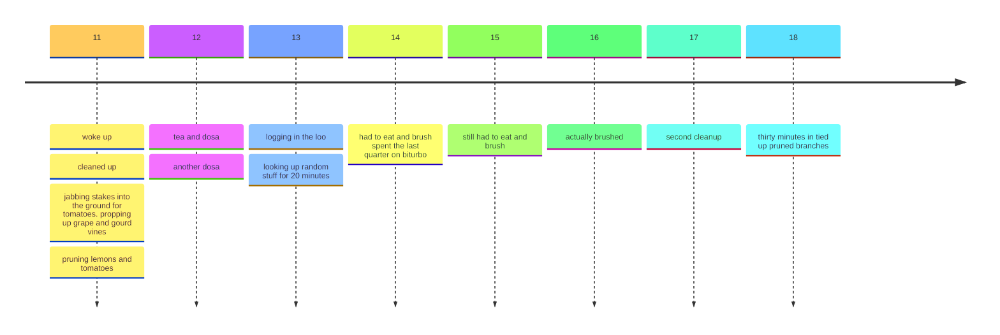
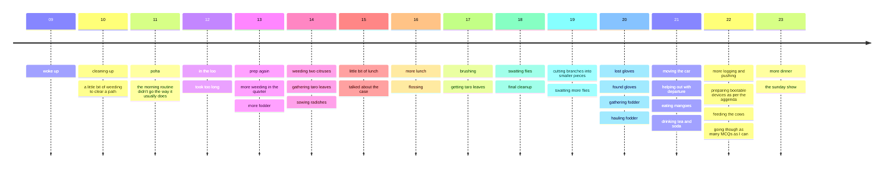

## saturday

``` mermaid
%%{init: { 'logLevel': 'debug', 'theme': 'base' } }%%
timeline
11: woke up: cleaned up: jabbing stakes into the ground for tomatoes. propping up grape and gourd vines: pruning lemons and tomatoes
12: tea and dosa: another dosa
13: logging in the loo: looking up random stuff for 20 minutes 
14: had to eat and brush spent the last quarter on biturbo
15: still had to eat and brush
16: actually brushed
17: second cleanup
18: thirty minutes in tied up pruned branches 

```
## sunday

```mermaid
timeline
09: woke up
10: cleaning-up: a little bit of weeding to clear a path
11: poha: the morning routine didn't go the way it usually does
12: in the loo: took too long
13: prep again: more weeding in the quarter: more fodder
14: weeding two citruses: gathering taro leaves: sowing radishes
15: little bit of lunch: talked about the case
16: more lunch: flossing
17: brushing: getting taro leaves
18: swatting flies: final cleanup
19: cutting branches into smaller pieces: swatting more flies
20: lost gloves: found gloves: gathering fodder: hauling fodder
21: moving the car: helping out with departure: eating mangoes: drinking tea and soda
22: more logging and pushing: preparing bootable devices as per the aggenda: feeding the cows: going though as many MCQs as I can
23: more dinner: the sunday show
```
