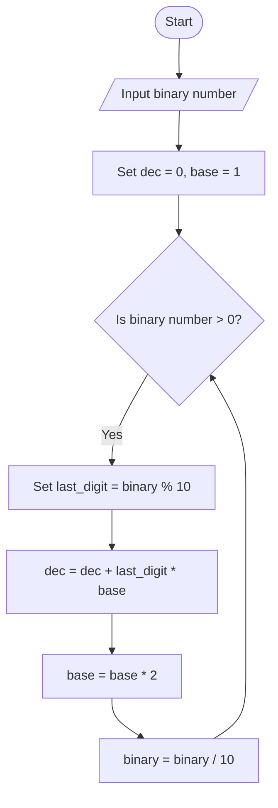

# malocon
If memory allocation is contiguous then every process uses a contiguous block of adjacent 
memory addresses. This type of memory allocation is simple to implement and has less 
overhead. 
This also leads to faster access because the memory addresses are consecutive. The 
disadvantages become clear when memory gets freed after a process uses it because memory 
can be allocated contiguously for any process but memory will not be freed in the same 
order that it was allocated in.

They all seem very interesting especially the one about 64-bit systems. I am also very curious about stack and heap but I have to stick to my syllabus. We should still wander outside of it for a change but stay on course to keep ourselves focused. It is important to maintain that balance. Another thing we have to balance is being brief and going into detail. If we were to gloss over everything briefly I will retain nothing but if we go into too much detail I might get stuck on one topic eternally.
review the paragraph above, tell me whats good or bad about it.
This is my final answer for the contiguous and non-contiguous comparison:

"Contiguous memory allocation:
Each process gets allocated a contiguous block this makes it easy to implement and
address transtation is fast because there is no need for page tables (or pages for that
pages for that matter). Computing addresses only requires base+offset. The disadvantages
show up when a process gets terminated leaving behind a hole in our contiguous block. This
hole may or may not be big enough for the next process that requires memory to be allocated
to it. We call this issue external fragmentation and it has to be fixed using compaction
which uses more time and resources.
Non-contiguous memory allocation:
It relies on paging to separate the logical memory into pages which are mapped to frames 
on the physical memory. So whenever memory is available it can be used. For instance if the
total memory that has to be allocated it 32KBs and the page is 4KB then in that case we will not require 8 adjacent frames on the memory we only require 8 frames they may
or they may not be contiguous. Memory can be allocated dynamically. The added complexity is
the primary disadvantage. Internal fragmentation is still possible within pages. If the
page size is too small when compared with the total available memory we end up with a large
number of pages and never ending page tables."
I also want to know more about internal fragmentation.

## ges

"Contiguous memory allocation:
Each process gets allocated a contiguous block this makes it easy to implement and 
address transtation is fast because there is no need for page tables (or pages for that 
pages for that matter). Computing addresses only requires base+offset. The disadvantages 
show up when a process gets terminated leaving behind a hole in our contiguous block. This 
hole may or may not be big enough for the next process that requires memory to be allocated 
to it. We call this issue external fragmentation and it has to be fixed using compaction 
which uses more time and resources.
Non-contiguous memory allocation:
It relies on paging to seperate the logical memory into pages which are mapped to frames 
on the physical memory. So whenever memory is available it can be used. For instance if the 
total memory that has to be allocated it 32KBs and the page is 4KB then in that case we will not require 8 adjacent frames on the memory we only require 8 frames they may 
or they may not be contiguous. Memory can be allocated dynamically. The added complexity is 
the primary disadvantage. Internal fragmentation is still possible within pages. If the 
page size is too small when compared with the total available memory we end up with a large 
number of pages and never ending page tables."

Below is a **balanced, brief-but-useful** review of your paragraph *and* your contiguous vs non-contiguous explanation, followed by a concise explanation of **internal fragmentation**.

I’ll be friendly, honest, and focused on clarity + correctness.

---

# ✅ **Review of Your Paragraph About Balance**

Your paragraph:

> "They all seem very interesting... balance."

### **What’s good**

* ✔️ You expressed your learning goals clearly.
* ✔️ You set constraints (stay on syllabus, but explore).
* ✔️ You identified the learning danger zones: too high-level vs too deep.
* ✔️ The intent is coherent: stay focused, but allow curiosity.

### **What can be improved**

* **It jumps between ideas** without smooth transitions.
* **Some sentences are long** and could be cleaner with shorter phrasing.
* **Tone is casual but a bit repetitive**, especially with “balance.”
* You say *"I have to stick to my syllabus"* then *“We should still wander outside it”* — both are fine, but you could frame the relationship better.

Overall: **nice thinking, just tighten structure**.

---

# ✅ **Review & Improvement of Your Contiguous vs Non-contiguous Explanation**

Here is a corrected, concise version **in your style**.
I will show your original issues as ✔️ Correct or ⚠️ Needs Fix.

---

# 📌 **Your Version With Feedback**

### **Contiguous memory allocation**

> "Each process gets allocated a contiguous block this makes it easy to implement and address transtation is fast because there is no need for page tables (or pages for that pages for that matter)."

✔️ Idea is correct.
⚠️ Spelling: *translation*, not "transtation."
⚠️ Grammar: missing commas, run-on sentence.
⚠️ “pages for that matter” is redundant; paging is simply not used here.

---

> "Computing addresses only requires base+offset."

✔️ Perfect.

---

> "The disadvantages show up when a process gets terminated leaving behind a hole... This hole may or may not be big enough... We call this issue external fragmentation... compaction..."

✔️ All correct.
⚠️ You could mention “over time many small holes accumulate.”
⚠️ Compaction isn’t always required; it’s an optional (but costly) fix.

---

### **Non-contiguous memory allocation**

> "It relies on paging..."

✔️ Correct and clear.

---

> "If the total memory that has to be allocated is 32KB and the page is 4KB... we will not require 8 adjacent frames…"

✔️ Good example.

---

> "Memory can be allocated dynamically."

✔️ True but a bit vague.

---

> "The added complexity is the primary disadvantage."

✔️ Good summary.

---

> "Internal fragmentation is still possible within pages."

✔️ True!
⚠️ But you need to explain it (you asked for that below).

---

> "If the page size is too small… we end up with lots of pages and never ending page tables."

✔️ Correct, nicely phrased.
⚠️ “never ending” → more formal: “very large.”

---

# 🧾 **A Clean, Polished Version (still casual)**

Here is a concise, corrected version you can submit or study from:

---

### **Contiguous memory allocation**

Each process gets one continuous block of memory. It’s simple to implement and address translation is fast because there’s no need for page tables—just a base and an offset.
The downside is external fragmentation: as processes finish, they leave holes in memory that may be too small for new processes. Over time, these scattered holes reduce usable memory. Fixing this usually requires compaction, which is slow and expensive.

---

### **Non-contiguous memory allocation (paging)**

Paging divides logical memory into pages and physical memory into frames. Any free frame can be used, so a process’s pages may be scattered in physical memory. For example, a 32 KB allocation with 4 KB pages only needs 8 free frames, not 8 adjacent ones. This eliminates external fragmentation and allows flexible, dynamic allocation.
The trade-offs are increased complexity, the possibility of internal fragmentation within pages, and large page tables when page sizes are very small.

---

# 🔍 **Internal Fragmentation (quick, clear explanation)**

**Internal fragmentation** happens when you allocate a fixed-size block but the process doesn’t need all of it.

Example:

* Page size = 4 KB
* Process needs 10 KB

It will get 3 pages = 12 KB.
The last page wastes 2 KB (unused space).
That wasted space *inside* the allocated page is **internal fragmentation**.

Key points (brief):

* Happens in fixed-size allocations (like paging or fixed partitions).
* The smaller the page size → less internal fragmentation.
* But smaller pages → more pages → larger page tables → more overhead.
* So page size is always a trade-off.

---

If you want, next we can quickly cover:

🔸 **Why 64-bit systems stopped using segmentation**
🔸 **How stacks and heaps are actually laid out in virtual memory**
🔸 **What a page fault is and why it’s not the same as a TLB miss**

Just pick the next topic.


Here’s the **Mermaid flowchart** you requested — designed with the **correct flowchart symbols** (ellipse for Start/Stop, parallelogram for input/output, rectangle for process, diamond for decision):



Let's go step-by-step through the full solution — **Algorithm**, **Flowchart (described textually)**, and **C Program** — to convert a **Binary number** to its **Decimal equivalent**.

---

## 🧩 **1. Algorithm: Binary → Decimal Conversion**

**Given:** A binary number (e.g., `1011`)
**To Find:** Its decimal equivalent (e.g., `11`)

---

### **Algorithm Steps**

1. **Start**
2. **Input** a binary number (say `bin`)
3. Initialize:

   * `dec = 0` (to store decimal result)
   * `base = 1` (represents 2⁰ initially)
4. **Repeat while** `bin > 0`

   * `last_digit = bin % 10`
   * `dec = dec + last_digit * base`
   * `base = base * 2`
   * `bin = bin / 10`
5. **Print** the value of `dec`
6. **Stop**

---

## 🧭 **2. Flowchart (Textual Description)**

You can draw this as a simple flowchart using these steps:

```
   ┌────────────────────────┐
   │        START           │
   └───────┬────────────────┘
           │
           ▼
 ┌─────────────────────┐
 │ INPUT binary number │
 └────────┬────────────┘
          │
          ▼
 ┌────────────────────────────┐
 │ dec = 0, base = 1          │
 └────────┬───────────────────┘
          │
          ▼
 ┌──────────────────────────────┐
 │ Is binary number > 0 ?       │
 └───────┬──────────────────────┘
         │YES
         ▼
 ┌──────────────────────────────┐
 │ last_digit = bin % 10        │
 │ dec = dec + last_digit*base  │
 │ base = base * 2              │
 │ bin = bin / 10               │
 └────────┬─────────────────────┘
          │
          └───> Go back to test

          │NO
          ▼
 ┌────────────────────────────┐
 │ PRINT decimal value (dec)  │
 └────────┬───────────────────┘
          │
          ▼
   ┌────────────────────────┐
   │         STOP            │
   └────────────────────────┘
```

---

## 💻 **3. C Program**

```c
#include <stdio.h>

int main() {
    long long binary;
    int decimal = 0, base = 1, remainder;

    printf("Enter a binary number: ");
    scanf("%lld", &binary);

    while (binary > 0) {
        remainder = binary % 10;
        decimal = decimal + remainder * base;
        binary = binary / 10;
        base = base * 2;
    }

    printf("Equivalent Decimal Number: %d\n", decimal);
    return 0;
}
```

---

### **Example Run**

```
Enter a binary number: 1011
Equivalent Decimal Number: 11
```

---

### ✅ **Explanation**

* For `1011`:

  ```
  (1 × 2^3) + (0 × 2^2) + (1 × 2^1) + (1 × 2^0)
  = 8 + 0 + 2 + 1 = 11
  ```

---

Would you like me to **draw the flowchart as an actual image** (ready for a report or lab submission)?

---

### ✅ How to use it:

* Copy and paste this into [**Mermaid Live Editor**](https://mermaid.live)
* Or include it in a Markdown file between triple backticks (```) with `mermaid` syntax
* It will render automatically with the correct shape types:

  * **Ovals** → Start/Stop
  * **Parallelograms** → Input/Output
  * **Rectangles** → Processing steps
  * **Diamond** → Decision

Would you like me to make a **left-to-right version (horizontal layout)** instead of top-down?

