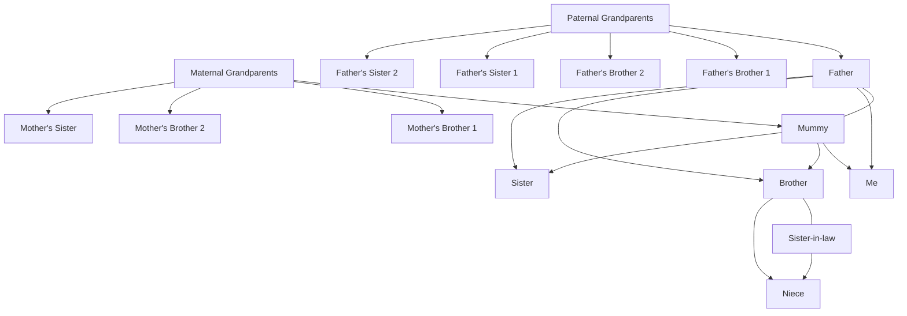

# graph

Here 

```mermaid
graph TD

%% Grandparents (not specified but implied)
GP1[Maternal Grandparents]
GP2[Paternal Grandparents]

%% Mother side
GP1 --> Mummy[Mummy]
GP1 --> MUB1[Mother's Brother 1]
GP1 --> MUB2[Mother's Brother 2]
GP1 --> MUS1[Mother's Sister]

%% Father side
GP2 --> Father[Father]
GP2 --> FUB1[Father's Brother 1]
GP2 --> FUB2[Father's Brother 2]
GP2 --> FUS1[Father's Sister 1]
GP2 --> FUS2[Father's Sister 2]

%% Parents
Father --- Mummy

%% Children
Mummy --> Me[Me]
Mummy --> Brother[Brother]
Mummy --> Sister[Sister]

Father --> Me
Father --> Brother
Father --> Sister

%% Brother's family
Brother --- SIL[Sister-in-law]
Brother --> Niece[Niece]
SIL --> Niece
```

