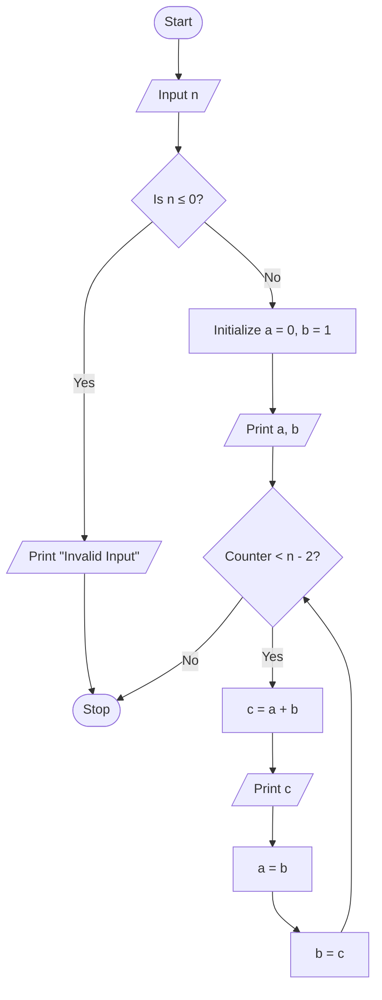

Below 

```mermaid
flowchart TD

    A([Start]) --> B[/Input n/]

    B --> C{Is n ≤ 0?}

    C -->|Yes| D[/Print "Invalid Input"/]
    D --> E([Stop])

    C -->|No| F[Initialize a = 0, b = 1]

    F --> G[/Print a, b/]

    G --> H{Counter < n - 2?}

    H -->|No| E([Stop])

    H -->|Yes| I[c = a + b]
    I --> J[/Print c/]
    J --> K[a = b]
    K --> L[b = c]

    L --> H
```

---

