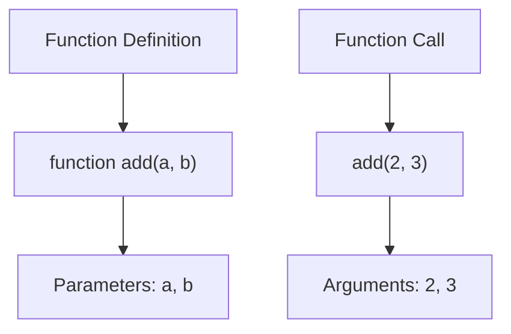
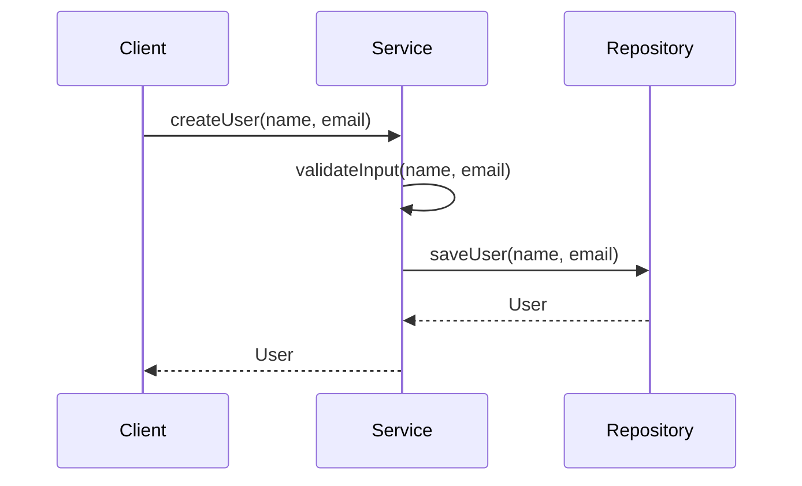
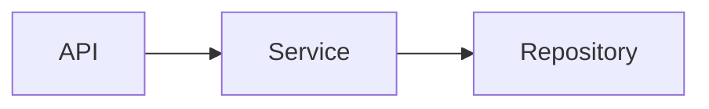

Yes—**Mermaid diagrams are actually very good for explaining methods, functions, arguments, and parameters**, especially in documentation and READMEs. Below are **concrete, copy-pasteable Mermaid examples**, plus **real people you can follow on GitHub** who work on Mermaid or are well-known for technical documentation and diagrams.

---

## 1. Function / Method Flow (Input → Processing → Output)

This is the most common way to explain what a function does.

```mermaid
flowchart LR
    A[Caller] -->|arg: userId| B[function getUser(userId)]
    B --> C[Validate userId]
    C --> D[Fetch user from DB]
    D -->|return User| A
```

**What this explains**

* Who calls the function
* What arguments are passed
* What internal steps happen
* What is returned

Great for backend services and APIs.

---

## 2. Parameters vs Arguments (Explicit Comparison)

This helps explain a **common confusion** clearly.



**Use case**

* Teaching
* Developer onboarding
* Blog posts

---

## 3. Method Call Sequence (Object-Oriented Code)

This is ideal for explaining **class methods**.



**Best for**

* Clean Architecture explanations
* Service layers
* Domain-driven design docs

---

## 4. Function with Optional Parameters & Defaults

```mermaid
flowchart TD
    A[call sendEmail(to, subject, body?)] --> B{body provided?}
    B -- Yes --> C[Use provided body]
    B -- No --> D[Use default template]
    C --> E[Send email]
    D --> E[Send email]
```

This makes **optional parameters** visually obvious.

---

## 5. API Endpoint → Function Mapping

Very common in web projects.

```mermaid
flowchart LR
    A[HTTP POST /users] --> B[createUserController(req, res)]
    B --> C[createUserService(name, email)]
    C --> D[createUser(name, email)]
```

Perfect for:

* Express / Fastify / NestJS docs
* REST API explanations

---

# People to Follow on GitHub (Mermaid & Diagrams)

These are **real, relevant, and searchable on GitHub**.

### 🧠 Mermaid Core & Tooling

* **Knut Sveidqvist**
  GitHub: `knsv`
  Creator of Mermaid.js

* **Mermaid-js**
  GitHub: `mermaid-js`
  Official Mermaid repository and contributors

---

### ✍️ Technical Diagrams & Documentation Influencers

* **Sarah Drasner**
  Known for clear visual explanations and diagrams (SVG, JS, architecture)

* **Dan Abramov**
  Excellent at explaining functions, parameters, and mental models

* **Addy Osmani**
  Writes deeply structured technical docs and diagrams

---

## How These Are Used in Real Repos

You’ll often see Mermaid diagrams:

* In `README.md`
* In `docs/architecture.md`
* In GitHub Wikis
* Rendered automatically in GitHub Markdown

Example pattern in docs:

````md
## createUser(name, email)



---

If you want, I can:
- Design a **Mermaid style guide** specifically for functions & methods
- Convert **real code** (JS, Python, Java) into Mermaid diagrams
- Show **how popular GitHub repos structure Mermaid docs**

Just tell me your language or project type.
```

