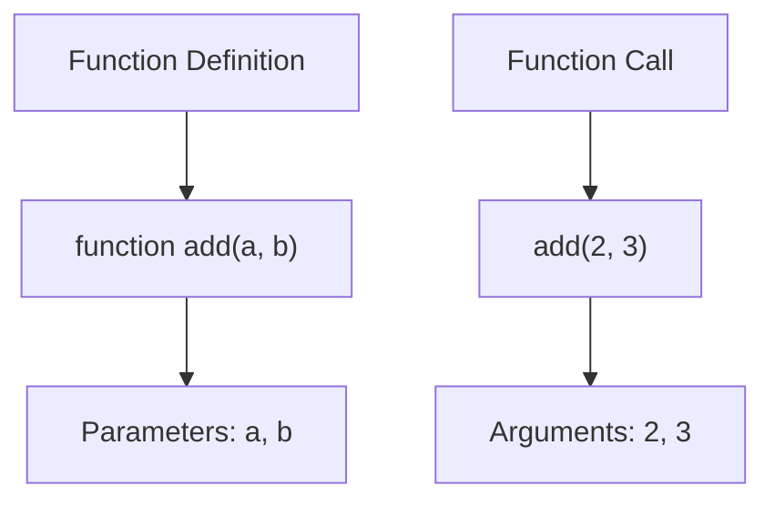
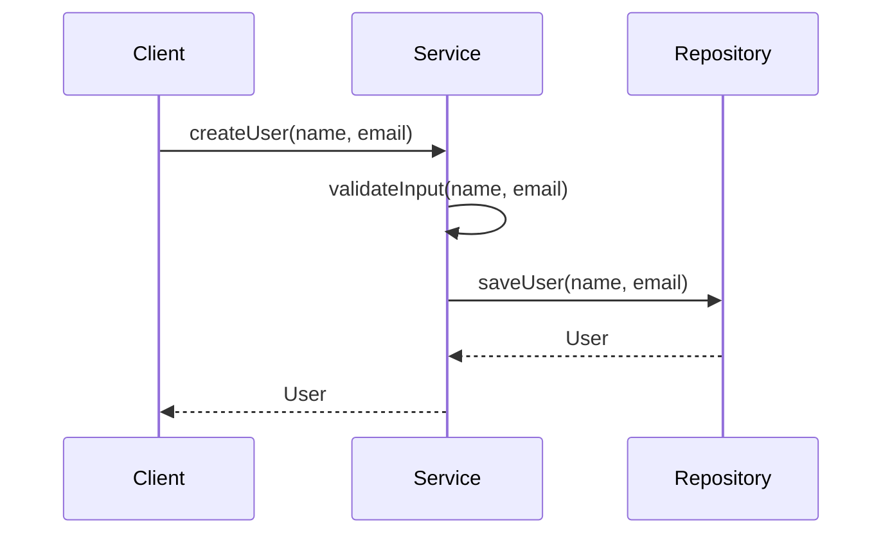
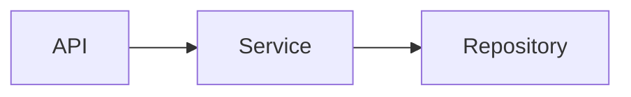
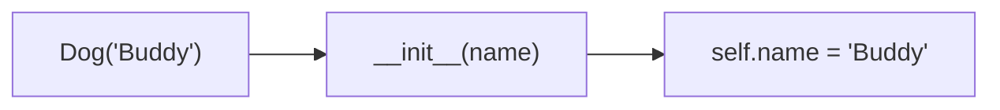

# parameters and arguments


Yes—**Mermaid diagrams are actually very good for explaining methods, functions, arguments, and parameters**, especially in documentation and READMEs. Below are **concrete, copy-pasteable Mermaid examples**, plus **real people you can follow on GitHub** who work on Mermaid or are well-known for technical documentation and diagrams.

---

## 1. Function / Method Flow (Input → Processing → Output)

This is the most common way to explain what a function does.

```mermaid
flowchart LR
    A[Caller] -->|arg: userId| B[function getUser(userId)]
    B --> C[Validate userId]
    C --> D[Fetch user from DB]
    D -->|return User| A
```

**What this explains**

* Who calls the function
* What arguments are passed
* What internal steps happen
* What is returned

Great for backend services and APIs.

---

## 2. Parameters vs Arguments (Explicit Comparison)

This helps explain a **common confusion** clearly.


```mermaid
flowchart TB
    A[Function Definition] --> B["function add(a, b)"]
    B --> C["Parameters: a, b"]

    D[Function Call] --> E["add(2, 3)"]
    E --> F["Arguments: 2, 3"]
```

**Use case**

* Teaching
* Developer onboarding
* Blog posts

---

## 3. Method Call Sequence (Object-Oriented Code)

This is ideal for explaining **class methods**.


```mermaid
sequenceDiagram
    participant Client
    participant Service
    participant Repository

    Client->>Service: createUser(name, email)
    Service->>Service: validateInput(name, email)
    Service->>Repository: saveUser(name, email)
    Repository-->>Service: User
    Service-->>Client: User
```

**Best for**

* Clean Architecture explanations
* Service layers
* Domain-driven design docs

---

## 4. Function with Optional Parameters & Defaults

```mermaid
flowchart TD
    A[call sendEmail(to, subject, body?)] --> B{body provided?}
    B -- Yes --> C[Use provided body]
    B -- No --> D[Use default template]
    C --> E[Send email]
    D --> E[Send email]
```

This makes **optional parameters** visually obvious.

---

## 5. API Endpoint → Function Mapping

Very common in web projects.

```mermaid
flowchart LR
    A[HTTP POST /users] --> B[createUserController(req, res)]
    B --> C[createUserService(name, email)]
    C --> D[createUser(name, email)]
```

Perfect for:

* Express / Fastify / NestJS docs
* REST API explanations

---

# People to Follow on GitHub (Mermaid & Diagrams)

These are **real, relevant, and searchable on GitHub**.

### 🧠 Mermaid Core & Tooling

* **Knut Sveidqvist**
  GitHub: `knsv`
  Creator of Mermaid.js

* **Mermaid-js**
  GitHub: `mermaid-js`
  Official Mermaid repository and contributors

---

### ✍️ Technical Diagrams & Documentation Influencers

* **Sarah Drasner**
  Known for clear visual explanations and diagrams (SVG, JS, architecture)

* **Dan Abramov**
  Excellent at explaining functions, parameters, and mental models

* **Addy Osmani**
  Writes deeply structured technical docs and diagrams

---

## How These Are Used in Real Repos

You’ll often see Mermaid diagrams:

* In `README.md`
* In `docs/architecture.md`
* In GitHub Wikis
* Rendered automatically in GitHub Markdown

Example pattern in docs:

````md
## createUser(name, email)


```mermaid
flowchart LR
    A[API] --> B[Service]
    B --> C[Repository]
````

```

---

If you want, I can:
- Design a **Mermaid style guide** specifically for functions & methods
- Convert **real code** (JS, Python, Java) into Mermaid diagrams
- Show **how popular GitHub repos structure Mermaid docs**

Just tell me your language or project type.
```

# methods attributes functions

Yes — you’ve got it 👍
Let’s make it **precise and simple**, step by step.

---

## 1. Is `name` a parameter and `"Buddy"` an argument?

### Short answer

✅ **Yes.**

### In the constructor

```python
class Dog:
    def __init__(self, name):
        self.name = name
```

* `name` → **parameter**
  (a variable in the method definition)

---

### When creating the object

```python
my_dog = Dog("Buddy")
```

* `"Buddy"` → **argument**
  (the actual value passed to the parameter)

### Mapping it clearly

| Term      | Meaning                            | Example   |
| --------- | ---------------------------------- | --------- |
| Parameter | Placeholder in a method definition | `name`    |
| Argument  | Actual value passed when calling   | `"Buddy"` |

So you can say:

> `name` is the **parameter**, and `"Buddy"` is the **argument**.

---

## 2. What is an **attribute**?

An **attribute** is **data stored on an object**.

It represents the **state** of that object.

### In this line:

```python
self.name = name
```

* `self.name` → **attribute**
* `name` → parameter value being assigned

---

## 3. Attribute vs Parameter vs Argument (side by side)

```python
class Dog:
    def __init__(self, name):   # ← parameter
        self.name = name        # ← attribute
```

```python
my_dog = Dog("Buddy")           # ← argument
```

| Term      | Lives where?      | Example       |
| --------- | ----------------- | ------------- |
| Parameter | Method definition | `name`        |
| Argument  | Method call       | `"Buddy"`     |
| Attribute | On the object     | `my_dog.name` |

---

## 4. Why attributes matter

Each object gets **its own copy** of attributes.

```python
dog1 = Dog("Buddy")
dog2 = Dog("Luna")

print(dog1.name)  # Buddy
print(dog2.name)  # Luna
```

Same class → different state.

---

## 5. Mental model (very important)

Think of it like this:

```text
Parameter → temporary input
Argument  → actual value
Attribute → stored memory on the object
```

Or in plain English:

> **Arguments fill parameters, and parameters initialize attributes.**

---

## 6. Tiny Mermaid diagram (optional visual)


```mermaid
flowchart LR
    A["Dog('Buddy')"] --> B["__init__(name)"]
    B --> C["self.name = 'Buddy'"]
```

---

### One-sentence takeaway

> `"Buddy"` is an **argument**, `name` is a **parameter**, and `self.name` is an **attribute** that permanently belongs to the object.

If you want next:

* Difference between **attributes vs local variables**
* **Class attributes vs instance attributes**
* Same concepts in **Java or JavaScript**


### What is a **method**?

A **method** is a **function that belongs to a class**.
It defines **behavior** that objects (instances of the class) can perform.

* A **function** → stands alone
* A **method** → lives inside a **class** and usually works with that class’s data

---

## Simple OOP example

Let’s use a very small, familiar example: a `Dog`.

### Class definition (Python-style)

```python
class Dog:
    def __init__(self, name):
        self.name = name

    def bark(self):
        print(f"{self.name} says woof!")
```

### What’s happening here

* `Dog` → the **class**
* `bark` → a **method**
* `self` → the **object (instance)** the method is acting on

---

## Creating an object (instance)

```python
my_dog = Dog("Buddy")
```

* `my_dog` is an **instance** of the `Dog` class
* It has its own data: `name = "Buddy"`

---

## Calling a method on an object

```python
my_dog.bark()
```

### Output

```
Buddy says woof!
```

---

## Key question:

### ❓ Can we call a method on an object or instance of a class?

### ✅ **Yes — that is exactly how methods are used.**

* Methods are **called on objects (instances)**
* The object is automatically passed into the method as `self`

Conceptually:

```text
object.method()
```

In this case:

```text
my_dog.bark()
```

---

## How to think about it intuitively

* **Class** → blueprint
* **Object / Instance** → real thing made from the blueprint
* **Method** → action the object can do

Example mapping:

| Concept | Real-world analogy |
| ------- | ------------------ |
| Class   | Dog blueprint      |
| Object  | Buddy the dog      |
| Method  | Barking            |
| Call    | “Buddy, bark!”     |

---

## One-sentence summary

> A **method** is a function defined inside a class, and **yes—you call methods on objects (instances) of that class**, not on thin air.

If you want, I can show:

* The same example in **Java / JavaScript**
* The difference between **instance methods vs static methods**
* A **Mermaid diagram** showing class → instance → method call


